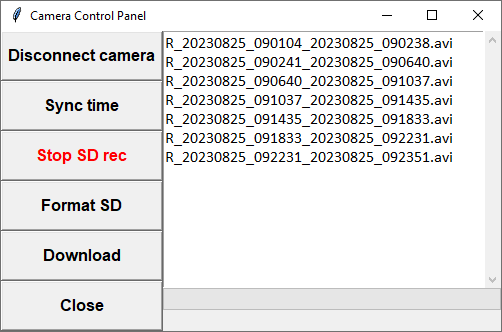

# Ocean Record
---
Разработка лаборатории гидролокации дна 
Developed in Sonar lab 

---
#### Программа предназначена для сбора данных БНПА "Видеомодуль", но также может быть использована для записи в лог-файл данных навигации, эхолота и прочих.

#### The program is developed for collecting data from TUV Videomodule. Also it may be used for logging such data as navigation, depth and so on.
---

### <u>Требования</u> / <u>dependencies</u>
+ python 3.7.9
+ pyserial
+ pillow
+ requests

Опционально для компиляции программы в exe файл:
+ pyinstaller
---
### Главное окно программы

В главном окне программы отображаются поступающие данные и производится контроль их записи в лог-файл, а также контроль создания субтитров к видео и подписей к фото, сохраняемым в процессе записи в ту же папку, что и лог-файл.

#### Функциии кнопок:

+ <b>Settings</b> - Открывает меню настроек.

+ <b>SRT</b> - Генерация субтитров к записанным видео с IP-камеры на основе лог-файла*. 

+ <b>Cam</b> - Открывает панель управления IP-камерой*.

+ <b>Connect</b> - Запускает считывание данных и их отображение в программе. Если какие-то данные поступают с ошибкой, на их месте высвечивается строка <i>Data Missing</i>.

+ <b>Start</b> - Старт записи лог-файла и сканирования директории,куда записываются видео и фото.  Если доступны данные навигации, в поле <i>Track length</i> производится подтсчет пройденного расстояния за время записи лог-файла.
При появлении в директории видео файла начинается запись субтитров к нему. При появлении в директории фото, в его левый верхний угол ставится штамп с текущими данными. Остановка записи лог-файла и сканирвоания диреткории произвоится этой же кнопкой.

+ <b>Set zero depth</b> - Установка нулевого значения глубины по датчику давления*.

+ <b>Reset track</b> - Сброс значений <i>Track length</i> и <i>Time elapsed</i>. Кнопка работает только при остановленной записи лог-файла.

### Меню Settings

 #### COM-ports settings

 В меню настроек <b>Settings</b> для каждого типа данных необходимо прописать порт, скорость и NMEA-идентификатор строки, из которой будут браться данные. Также возле каждого типа данных стоит чекбокс, который определяет, будет ли осуществляться сбор этих данных. В области <i>Message</i> прописывается идентификатор NMEA-строки, из которой будут браться данные.

 #### Доступные типы данных:

+ <b>Navigation</b> - данные навигации. Доступные значения Message: <b>RMC, GGA, GLL</b>
+ <b>Depth</b> - глубина по датчику давления. Доступные значения Message: <b>DBS, DBT</b>
+ <b>Altimeter</b> - отстояние от грунта. Доступные значения Message: <b>DBS, DBT</b>
+ <b>Temperature</b> - температура воды. Доступные значения Message: <b>MTW</b>
+ <b>Ship Sonar</b> - глубина по судовому эхолоту. Доступные значения Message: <b>DBS, DBT</b>
+ <b>Inclinometer</b> - датчик положения аппарата*. Специализированный канал данных БНПА "Видеомодуль".

#### IP-camera settings
Настройки IP-камеры* : URL, логин, пароль.

#### Common

* Выбор папки записи определяет директорию, куда будет записываться лог-файл, а также видеозаписи и фотоснимки с IP-камеры. Если соединение с камерой установлено, изменение папки записи в программе автоматически изменяет папку записи в настройках камеры.
* Log frequency - период записи новой строки в лог-файл в секундах.
* UTC Time - если стоит галочка, отображается и записывается время в UTC. Если галочка не стоит - местное время. В обоих случаях берется время компьютера.

<i>Настройки хранятся в файле "resources/settings.xml". Если файла не существует, он будет создан автоматически, однако папку "resources" удалять не следует, т.к. в этом случае программа не будет работать.</i> 

### Панель управления камерой*

Все функции рассчитаны на работу с камерой Beward BD3670M.
В области текста отображается список файлов, записанных на SD-карту камеры. Список обнвляется при нажатии кнопок записи, форматирования, а также при закрытии/открытии окна панели управления камерой.

+ <b>Connect camera</b> - Проверка соединения с камерой. Если проверка успешна, активация функций других кнопок.

+ <b>Sync time</b> - Синхронизация времени камеры и ПК.

+ <b>Start/Stop SD rec</b> - Кнопка начала и остановки записи видео на SD-карту, установленную на камере.

+ <b>Format SD</b> - Форматирование SD карты.

+ <b>Download</b> - Скачивание видеофайлов с камеры (см. следующий раздел).

#### Скачивание файлов

Для скачивания файлов нужно нажать кнопку <b>Donwload</b>, после чего начнется загрузка файлов из списка в ту же папку, куда производилась запись лог-файла. Окно в этот момент станет неактивно, пока загрузка не завершится или не будет отменена пользователем.

---
\* указанные фукнкции работают только с оборудованием, установленном на БНПА "Видеомодуль": IP-камера Beward, датчик давления в контроллером OceanSense, датчик положения.