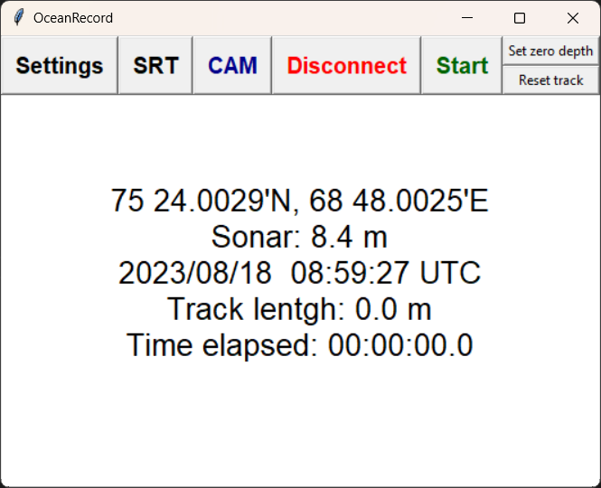

# OceanRecord
### v. 5.0.0- 15.08. 2023
---
Разработка лаборатории гидролокации дна 
Developed in Sonar lab 

---
#### Программа предназначена для сбора данных БНПА "Видеомодуль", но также может быть использована для записи в лог-файл данных навигации, эхолота и прочих.

#### The program is developed for collecting data from TUV Videomodule. Also it may be used for logging such data as navigation, depth and so on.
---

### <u>Требования</u> / <u>dependencies</u>
+ python 3.7.9
+ pyserial
+ pillow
+ requests
---
### Главное окно программы

Программа запускается с приветственным экраном. Для начала отображения данных необходимо нажать кнопку <b>Connect</b>.

### Меню Settings

Программа предназначена для записи данных с сенсоров, представляющих данные в виде строк протокола NMEA0183 посредством опроса COM-портов. В меню настроек <b>Settings</b> для каждого типа данных необходимо прописать порт, скорость и NMEA-идентификатор строки, из которой будут браться данные. Также возле каждого типа данных стоит чекбокс, который определяет, будет ли осуществляться сбор этих данных.

Тип данных <b>Inclinometer</b> является специальным для обмена данными с датчиком положения, установленном в БНПА "Видеомодуль".

Выбор папки записи определяет директорию, куда будет записываться лог-файл, а также видеозаписи и фотоснимки с IP-камеры. Если соединение с камерой установлено, изменение папки записи в программе автоматически изменяет папку записи в настройках камеры.

<i>Настройки хранятся в файле "resources/settings.xml". Если файла не существует, он будет создан автоматически, однако папку "resources" удалять не следует, т.к. в этом случае программа не будет работать.</i> 